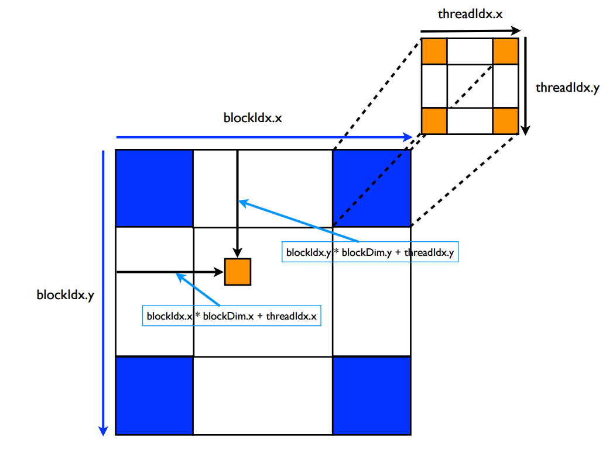

## dim3的理解

  在启动`kernel`的时候，要通过指定`gridsize`和`blocksize`才行，举下面的例子说说:
```cuda
dim3 gridsize(2,2);
dim3 blocksize(4,4);
```
`gridsize`相当于是一个`2*2`的`block`，`gridDim.x`，`gridDim.y`，`gridDim.z`
相当于这个`dim3`的`x`，`y`，`z`方向的维度，这里是`2*2*1`。序号从`0`到`3`，且是**从上到下**的顺序，就是说是下面的情况:

`grid`中的`blockidx`序号标注情况为：            
```
0  2 
1  3
```
`blocksize`则是指里面的`thread`的情况，`blockDim.x`，`blockDim.y`，`blockDim.z`相当于这个`dim3`的`x`，`y`，`z`方向的维度，
这里是`4*4*1`，序号是`0-15`，也是**从上到下**的标注：

`block`中的`threadidx`序号标注情况：
```
0  4  8  12 
1  5  9  13
2  6  10  14
3  7  11  15
```
例子：
```cuda
int col = blockIdx.x * blockDim.x + threadIdx.x; 
int row = blockIdx.y * blockDim.y + threadIdx.y; 
```




